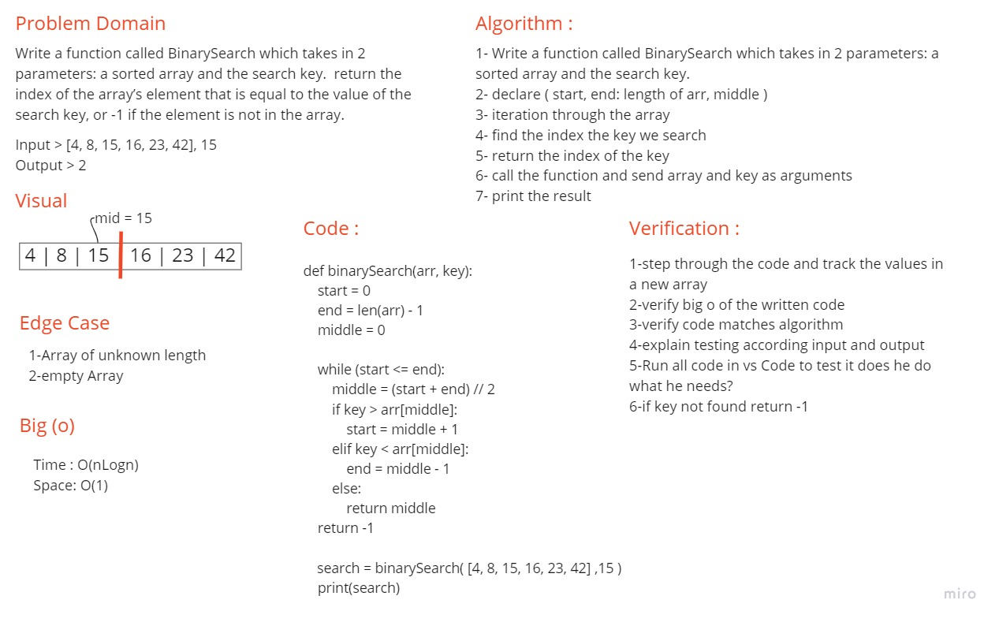

# Code Challenge: Class 03

## Write a function called BinarySearch which takes in 2 parameters: a sorted array and the search key.  return the index of the array’s element that is equal to the value of the search key, or -1 if the element is not in the array.

